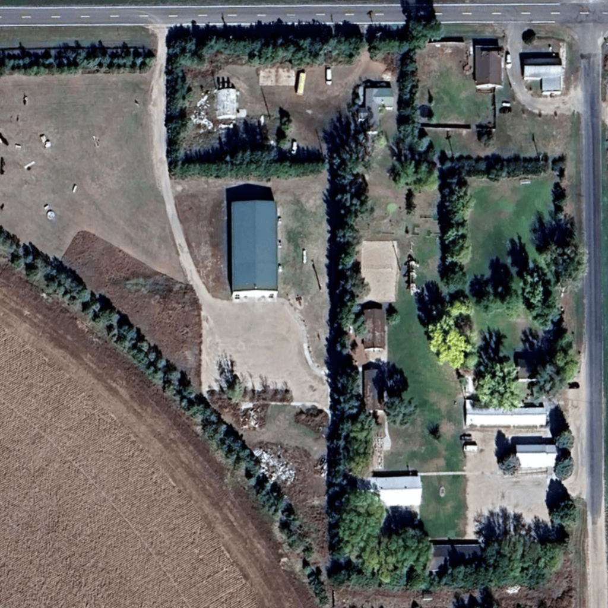

# Minecraft-Map-Maker
Overlays a coordinatized grid onto an image

This project generates a coordinatized grid onto an image for creating custom map arts or replicating real life areas in minecraft.

### Purpose
* This is *amazing* for building real life areas in **Minecraft**

* This is a project I made because all of the tools I found online to overlay a grid into an image sucked. 

### Notice

* **The python code was generated by AI**; however, I understand how it works, I could've done it, but I wanted to build the project, not spend hours coding the grid maker.

* *The whole code is currently commented* out because I wasn't 100% sure of the process needed for creating a **virtual environment** on a git repository.

### Example
Take an image of an area you want to be gridded

Your output will look like this, I used it to measure exact location of buildings at a camp I was working at so I could build a scale model of the camp in minecraft
